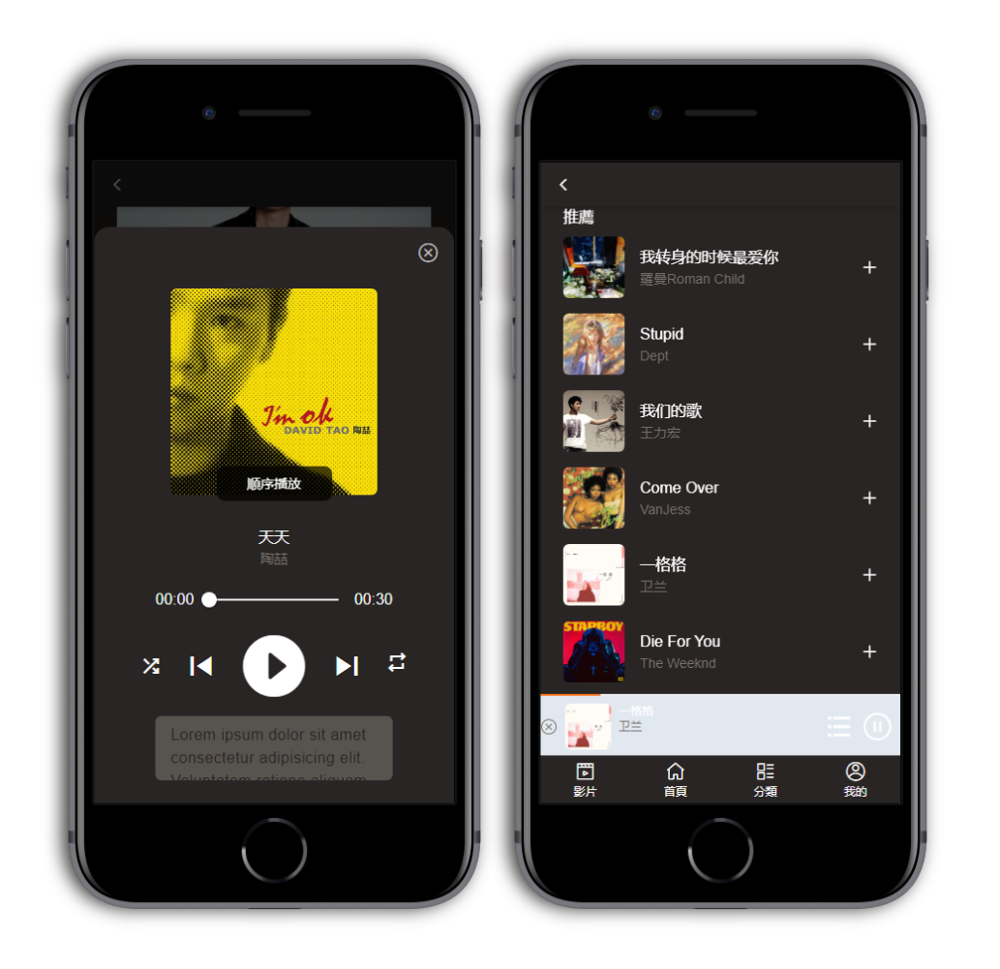

# chiuchiu-musicplayer

DEMO:[chiuchiu-musicplayer](https://chiuchiu-music.onrender.com/#/main)  
登入測試手機18681547948

使用vue3、樣式框架為vant4開發的音樂播放器。
+ 前端框架： Vue3 + Vue router + pinia + axios。  
+ 前端UI框架及樣式: Vant4/SCSS/TailwindCSS。  
+ 打包工具: Vite。

## 音樂播放器

功能:  
+ 播放/暫停。
+ 前一首/下一首。
+ 隨機播放/單曲循環/「隨歌曲進度條播放」。
+ 動態歌詞(開發中)。     
      

## JWT登入

功能:  
+ 校驗規則。
+ 登入成功訊息。     
      

## i18n語言切換

功能:  
+ 中英文切換。
 

## 主題樣式

功能:  
+ 設定明亮模式。
 

